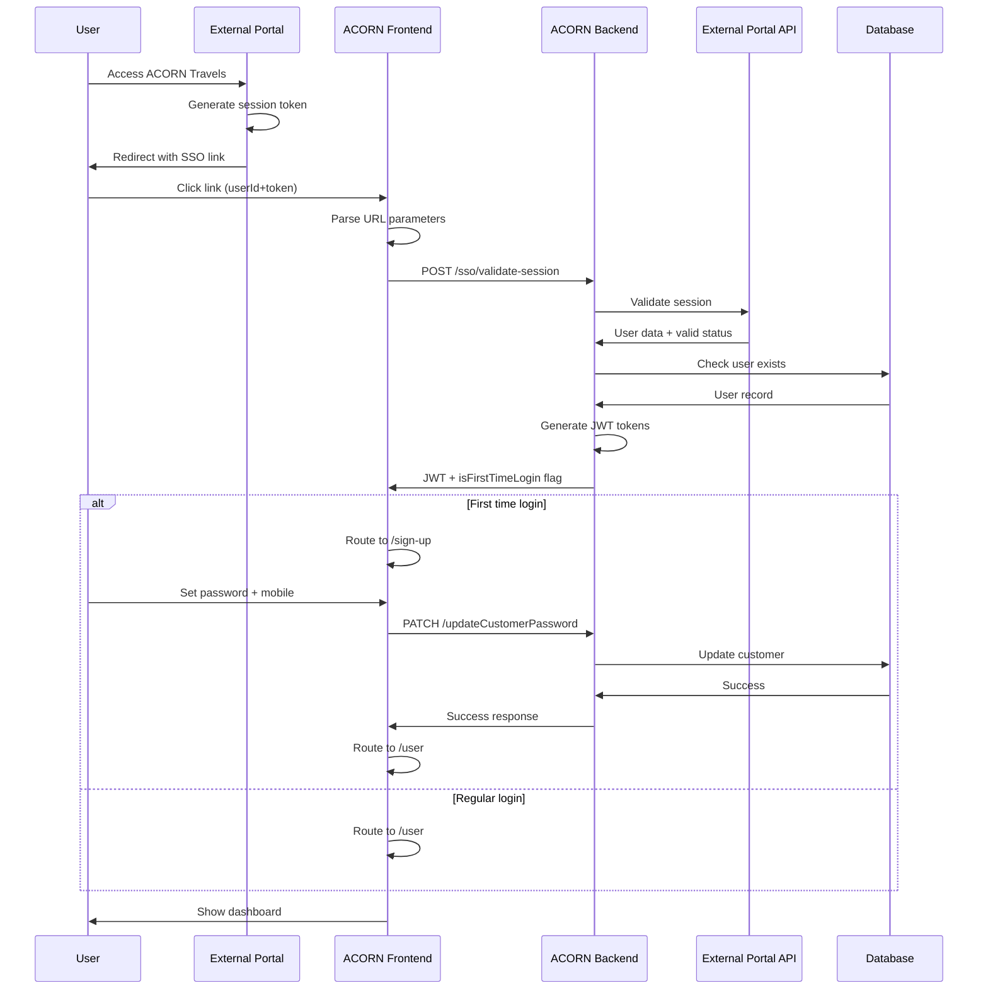
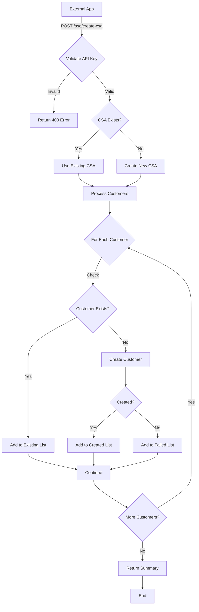
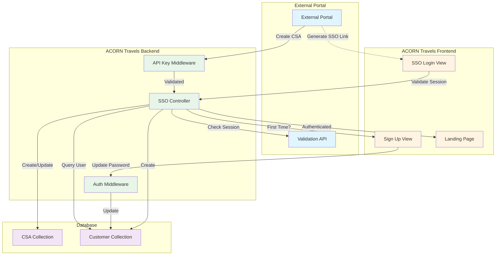

# SSO Architecture & Flow Diagrams

This document contains visual representations of the SSO implementation architecture and flows.

## System Architecture

```
┌─────────────────────────────────────────────────────────────────────┐
│                         ACORN Travels System                         │
├─────────────────────────────────────────────────────────────────────┤
│                                                                       │
│  ┌──────────────────┐              ┌───────────────────┐            │
│  │                  │              │                   │            │
│  │   Frontend       │◄────────────►│    Backend        │            │
│  │   React/TS       │   REST API   │    Node.js        │            │
│  │                  │              │    Express        │            │
│  └────────┬─────────┘              └─────────┬─────────┘            │
│           │                                  │                       │
│           │                                  │                       │
│           ▼                                  ▼                       │
│  ┌──────────────────┐              ┌───────────────────┐            │
│  │  SSO Components  │              │  SSO Endpoints    │            │
│  │  - sso-login     │              │  - validate       │            │
│  │  - sign-up       │              │  - create-csa     │            │
│  │  - routing       │              │  - check-user     │            │
│  └──────────────────┘              └─────────┬─────────┘            │
│                                              │                       │
└──────────────────────────────────────────────┼───────────────────────┘
                                               │
                                               │ External API Call
                                               │
                                               ▼
                        ┌───────────────────────────────────┐
                        │   External Client Portal          │
                        ├───────────────────────────────────┤
                        │  - Session Management             │
                        │  - User Database                  │
                        │  - Validation Endpoint            │
                        │  - SSO Link Generation            │
                        └───────────────────────────────────┘
```

## Component Interaction Diagram

```
┌─────────────┐         ┌─────────────┐         ┌──────────────┐
│   Browser   │         │   ACORN     │         │   External   │
│   (User)    │         │   Backend   │         │   Portal     │
└──────┬──────┘         └──────┬──────┘         └──────┬───────┘
       │                       │                       │
       │  1. Click SSO Link    │                       │
       ├──────────────────────►│                       │
       │  (userId+token)        │                       │
       │                       │                       │
       │                       │  2. Validate Session  │
       │                       ├──────────────────────►│
       │                       │   (userId+token)      │
       │                       │                       │
       │                       │  3. Session Valid     │
       │                       │◄──────────────────────┤
       │                       │   (user data)         │
       │                       │                       │
       │                       │  4. Check User DB     │
       │                       ├───────┐               │
       │                       │       │               │
       │                       │◄──────┘               │
       │                       │                       │
       │  5. JWT Tokens        │                       │
       │◄──────────────────────┤                       │
       │  + isFirstTimeLogin   │                       │
       │                       │                       │
       │  6. Route User        │                       │
       ├───────┐               │                       │
       │       │               │                       │
       │◄──────┘               │                       │
       │  (/user or /sign-up)  │                       │
       │                       │                       │
```

## Flow 1: Existing User SSO Login

```
┌──────────┐
│  Start   │
└────┬─────┘
     │
     ▼
┌─────────────────────────────────┐
│ User clicks SSO link in         │
│ External Portal                  │
└────────────┬────────────────────┘
             │
             ▼
┌─────────────────────────────────┐
│ Frontend: Parse URL parameters  │
│ (userId, sessionToken)           │
└────────────┬────────────────────┘
             │
             ▼
┌─────────────────────────────────┐
│ Call: POST /sso/validate-session│
└────────────┬────────────────────┘
             │
             ▼
┌─────────────────────────────────┐
│ Backend: Validate with External │
│ Portal API                       │
└────────────┬────────────────────┘
             │
             ▼
        ┌────┴────┐
        │ Valid?  │
        └────┬────┘
             │
      ┌──────┴──────┐
      │             │
      ▼             ▼
   ┌─────┐      ┌──────┐
   │ No  │      │ Yes  │
   └──┬──┘      └───┬──┘
      │             │
      ▼             ▼
┌──────────┐  ┌────────────────────┐
│  Error   │  │ Check if user has  │
│ Message  │  │ password set       │
└──────────┘  └─────────┬──────────┘
                        │
                   ┌────┴────┐
                   │Password?│
                   └────┬────┘
                        │
                 ┌──────┴──────┐
                 │             │
                 ▼             ▼
             ┌──────┐      ┌──────┐
             │ Yes  │      │  No  │
             └───┬──┘      └───┬──┘
                 │             │
                 ▼             ▼
        ┌─────────────┐  ┌──────────────┐
        │Generate JWT │  │ Generate JWT │
        │isFirstTime: │  │ isFirstTime: │
        │   false     │  │    true      │
        └──────┬──────┘  └──────┬───────┘
               │                │
               ▼                ▼
        ┌────────────┐   ┌──────────────┐
        │ Redirect   │   │  Redirect    │
        │ to /user   │   │ to /sign-up  │
        └──────┬─────┘   └──────┬───────┘
               │                │
               └────────┬───────┘
                        │
                        ▼
                   ┌─────────┐
                   │   End   │
                   └─────────┘
```

## Flow 2: External App Creates CSA

```
┌──────────────────┐
│  External App    │
└────────┬─────────┘
         │
         ▼
┌─────────────────────────────────┐
│ POST /sso/create-csa             │
│ Headers: X-API-Key               │
│ Body: CSA + Customers data       │
└────────────┬────────────────────┘
             │
             ▼
┌─────────────────────────────────┐
│ Backend: Validate API Key        │
└────────────┬────────────────────┘
             │
             ▼
        ┌────┴────┐
        │ Valid?  │
        └────┬────┘
             │
      ┌──────┴──────┐
      │             │
      ▼             ▼
   ┌─────┐      ┌──────┐
   │ No  │      │ Yes  │
   └──┬──┘      └───┬──┘
      │             │
      ▼             ▼
┌──────────┐  ┌────────────────────┐
│ 403      │  │ Check if CSA       │
│ Error    │  │ already exists     │
└──────────┘  └─────────┬──────────┘
                        │
                   ┌────┴────┐
                   │ Exists? │
                   └────┬────┘
                        │
                 ┌──────┴──────┐
                 │             │
                 ▼             ▼
             ┌──────┐      ┌──────────┐
             │ Yes  │      │   No     │
             └───┬──┘      └───┬──────┘
                 │             │
                 ▼             ▼
        ┌─────────────┐  ┌──────────────┐
        │ Use Existing│  │ Create New   │
        │    CSA      │  │    CSA       │
        └──────┬──────┘  └──────┬───────┘
               │                │
               └────────┬───────┘
                        │
                        ▼
           ┌─────────────────────────┐
           │ For each customer:      │
           │ - Check if exists       │
           │ - Create if not exists  │
           │ - Track results         │
           └────────────┬────────────┘
                        │
                        ▼
           ┌─────────────────────────┐
           │ Return Summary:         │
           │ - Created customers     │
           │ - Existing customers    │
           │ - Failed customers      │
           └────────────┬────────────┘
                        │
                        ▼
                   ┌─────────┐
                   │   End   │
                   └─────────┘
```

## Data Flow Diagram

```
┌────────────────────────────────────────────────────────────────┐
│                     External Portal                            │
│                                                                 │
│  ┌──────────┐         ┌────────────┐       ┌──────────────┐  │
│  │   User   │────────►│  Session   │──────►│  Generate    │  │
│  │  Clicks  │         │   Token    │       │  SSO Link    │  │
│  └──────────┘         └────────────┘       └──────┬───────┘  │
│                                                    │           │
└────────────────────────────────────────────────────┼───────────┘
                                                     │
                                                     │ userId
                                                     │ sessionToken
                                                     ▼
┌────────────────────────────────────────────────────────────────┐
│                    ACORN Travels Frontend                       │
│                                                                 │
│  ┌──────────────┐      ┌───────────────┐    ┌──────────────┐ │
│  │Parse URL     │─────►│  Validate     │───►│   Store      │ │
│  │Parameters    │      │  Session API  │    │   Tokens     │ │
│  └──────────────┘      └───────┬───────┘    └──────┬───────┘ │
│                                │                    │          │
└────────────────────────────────┼────────────────────┼──────────┘
                                 │                    │
                                 ▼                    │
┌────────────────────────────────────────────────────┼───────────┐
│                    ACORN Travels Backend           │           │
│                                                     │           │
│  ┌──────────────┐      ┌───────────────┐    ┌─────▼──────────┐│
│  │ SSO          │─────►│  Validate     │───►│  Generate JWT  ││
│  │ Controller   │      │  with Portal  │    │  Tokens        ││
│  └──────────────┘      └───────┬───────┘    └────────────────┘│
│                                │                               │
│                                ▼                               │
│                       ┌─────────────────┐                      │
│                       │  Check User DB  │                      │
│                       └────────┬────────┘                      │
│                                │                               │
└────────────────────────────────┼───────────────────────────────┘
                                 │
                                 ▼
                        ┌─────────────────┐
                        │   MongoDB       │
                        │   - Customers   │
                        │   - CSAs        │
                        └─────────────────┘
```

## Security Architecture

```
┌──────────────────────────────────────────────────────────────┐
│                     Security Layers                           │
├──────────────────────────────────────────────────────────────┤
│                                                               │
│  Layer 1: HTTPS/TLS                                          │
│  ┌────────────────────────────────────────────────────────┐ │
│  │  All communications encrypted in transit               │ │
│  └────────────────────────────────────────────────────────┘ │
│                                                               │
│  Layer 2: Rate Limiting                                      │
│  ┌────────────────────────────────────────────────────────┐ │
│  │  - 100 requests per 15 minutes (general)              │ │
│  │  - Lower limits on auth endpoints                      │ │
│  └────────────────────────────────────────────────────────┘ │
│                                                               │
│  Layer 3: Authentication                                     │
│  ┌────────────────────────────────────────────────────────┐ │
│  │  - API Key validation (external apps)                 │ │
│  │  - Session token validation (SSO)                     │ │
│  │  - JWT tokens (authenticated users)                   │ │
│  └────────────────────────────────────────────────────────┘ │
│                                                               │
│  Layer 4: Input Validation                                   │
│  ┌────────────────────────────────────────────────────────┐ │
│  │  - Email format validation                            │ │
│  │  - Required field checks                              │ │
│  │  - Data type validation                               │ │
│  └────────────────────────────────────────────────────────┘ │
│                                                               │
│  Layer 5: Database Security                                  │
│  ┌────────────────────────────────────────────────────────┐ │
│  │  - Password hashing (bcrypt)                          │ │
│  │  - Parameterized queries                              │ │
│  │  - Access control                                     │ │
│  └────────────────────────────────────────────────────────┘ │
│                                                               │
└──────────────────────────────────────────────────────────────┘
```

## Database Schema Relationships

```
┌─────────────────────────────────────────────────────────────┐
│                    Database Schema                           │
└─────────────────────────────────────────────────────────────┘

┌─────────────────────────┐
│         CSA             │
├─────────────────────────┤
│ csaId (PK)              │◄──────┐
│ name                    │       │
│ email (unique)          │       │
│ mobile                  │       │
│ password (hashed)       │       │
│ customers (array)       │       │
│ createdAt               │       │
│ updatedAt               │       │
└─────────────────────────┘       │
                                  │
                                  │ 1:N
                                  │ (csa field)
                                  │
┌─────────────────────────┐       │
│      Customer           │       │
├─────────────────────────┤       │
│ customerId (PK)         │       │
│ name                    │       │
│ email (unique)          │       │
│ password (nullable)     │───────┘
│ csa (FK) ───────────────┘
│ incidents (array)       │
│ notifications (array)   │
│ feedbacks (array)       │
│ travelHistory (array)   │
│ createdAt               │
│ updatedAt               │
└─────────────────────────┘

Notes:
- password is NULL for customers created via SSO
  until they complete registration
- csa field links to CSA.csaId
```

## Mermaid Diagrams

If your markdown renderer supports Mermaid, here are interactive diagrams:

### SSO Login Sequence Diagram



### CSA Creation Flow



### System Component Interaction



---

## Legend

```
┌─────────┐
│Component│  = System component or module
└─────────┘

    │
    ▼         = Data/Control flow

───────►     = Direct communication

··········►  = Indirect/Optional communication

┌────────┐
│ Decision│  = Conditional logic
└────────┘

[Database]   = Data storage
```

## Notes

1. All diagrams show the happy path. Error handling flows are omitted for clarity.
2. External Portal API details may vary based on implementation.
3. Database schema shows only SSO-relevant fields.
4. Mermaid diagrams require a Mermaid-compatible renderer to display properly.

---

**Last Updated**: November 26, 2024  
**Version**: 1.0.0

